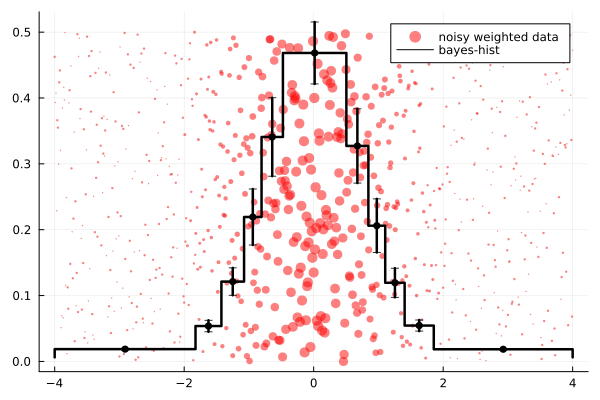

# BayesHistogram.jl
Optimal histogram binning based on piecewise constant model.

Paper: _Studies in Astronomical Time Series Analysis. VI. Bayesian Block Representations_ [https://arxiv.org/abs/1207.5578]

- [BayesHistogram.jl](#bayeshistogramjl)
  - [Introduction](#introduction)
  - [Installation](#installation)
  - [Usage examples](#usage-examples)
  - [Showcase](#showcase)
    - [bins are determined automatically & optimally](#bins-are-determined-automatically--optimally)
    - [it handles weighted data and errors correctly](#it-handles-weighted-data-and-errors-correctly)
    - [it routinely outperforms common binning rules](#it-routinely-outperforms-common-binning-rules)

## Introduction
Have you ever hated the default histogram binning rules in your favourite analysis and plotting library?

You can try to solve your problem by relying on `BayesHistogram.jl`! :)

This package provides the function `bayesian_blocks`, which determines the bin sequence that maximises the probability of observing your data, assuming it can be described by a histogram.

In other words, the package implements a complicated algorithm that returns the optimal histogram, respecting some simple constraints that can be customised.

If you can't take it any more, go directly to the usage examples or, for more details, to the file `make_plot.jl` or if you want to know all the internal details `test/run_tests.jl`.

The optimal histogram is determined by four ingredients:
1) The likelihood of a given bin.
2) The a-priori probability of observing that bin.
3) The maximum resolution at which you want to separate the data (default is `Inf`).
4) The minimum possible number of observations in each bin (default is `1`).

How can you influence these factors?

1) It is not modifiable, for a long time now the Likelihood principle and its natural Bayesian extension have been part of the toolbox of every statistician: it is a solid principle that can be reasonably trusted :)
   
2) It is modifiable, the package implements a wide choice of possibilities, the prior can be chosen among the following alternatives:
   
   - `BIC` (default): Bayesian information criterion, requires no parameters and is asymptotically consistent.
   - `AIC`: Akaike information criterion: minimizes prediction error, requires no parameters (in some cases adds too many bins, but the problem can be solved using (2) and (3)).
   - `HQIC`: Hannan-Quinn criterion, has intermediate behaviour between BIC and AIC, is close to consistency, tries to minimise prediction error.
   - `FPR(p)`: Scargle Criterion, a data bin is added if it has a false positive rate lower than `p`.
   - `Geometric(gamma)`: varying the parameter `gamma` changes the average number of bins to be observed.
   - `Pearson(p)`: this is useful when you want bins containing about `N*p` observations, where `N` is the total number of events.
   - `NoPrior`: for non-Bayesians, always requires the tuning of (3) and (4).
   - `?`, You can implement a customised prior by following the examples in the `src/priors.jl` file 
  
3) If you need to alter this parameter, simply add the keyword argument `resolution = ?` to the `bayesian_blocks` function, a typical value might be `100`.

4) Similar to (3), this can be configured via `min_counts = ?`.

Thank you for reading this (brief?) introductory section.

## Installation
```julia
using Pkg
Pkg.add("BayesHistogram")
```

## Usage examples
for looking at every option available type in the repl `?bayesian_blocks`.

Examples:
```julia
using Plots, BayesHistogram
X = exp.(randn(5000)./3)
bl = bayesian_blocks(X)
# plot using "to_pdf"
support, density = to_pdf(bl)
plot(support, density)
# or using "edges" parameter and an histogramming procedure
histogram(X, bins=bl.edges, normalize = :pdf)
```
we can change the prior as follows:
```julia
bl = bayesian_blocks(X, prior=AIC(), resolution=40)
plot(to_pdf(bl)...)
bl = bayesian_blocks(X, prior=FPR(0.2), resolution=40)
plot!(to_pdf(bl)...)
```
we can also plot the errors:
```julia
plot(to_pdf(bl)..., color="black")
scatter!(bl.centers, bl.heights, yerr = bl.error_heights, color="black")
```
we can also estimate averages and their errors:
```julia
estimate(bl) do v; v end 
# result: (1.0610279949641472, 0.014646660658986687)

# the result can be refined by increasing the number of integration points

estimate(bl,100) do v; v^2 end 
# result: (1.2574274634942957, 0.021142852215391358)
```
## Showcase
### bins are determined automatically & optimally 

### it handles weighted data and errors correctly

### it routinely outperforms common binning rules


