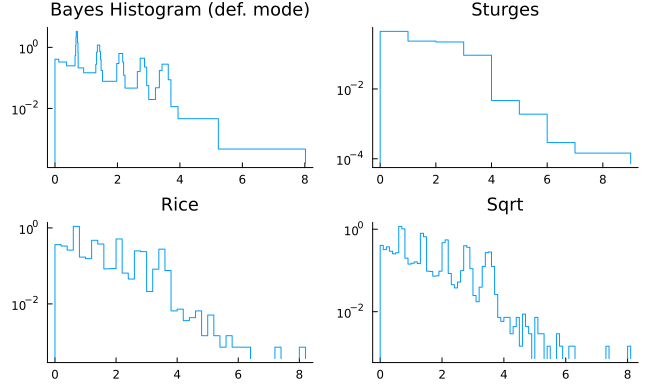

# BayesHistogram.jl
Optimal histogram binning based on piecewise constant model.

Paper: _Studies in Astronomical Time Series Analysis. VI. Bayesian Block Representations_ [https://arxiv.org/abs/1207.5578]

for more worked examples read `make_plot.jl`.
for a showcase look below.

## Installation
```julia
using Pkg
Pkg.add("BayesHistogram")
```

## Simple usage
```julia
using Plots, BayesHistogram
X = exp.(randn(5000)./3)
bl = bayesian_blocks(X)
# plot using "to_pdf"
support, density = to_pdf(bl)
plot(support, density)
# or using "edges" parameter and an histogramming procedure
histogram(X, bins=bl.edges, normalize = :pdf)
```

## Showcase
### it handles weighted data and errors correctly

### bins are determined automatically & optimally 

### it routinely outperforms common binning rules


